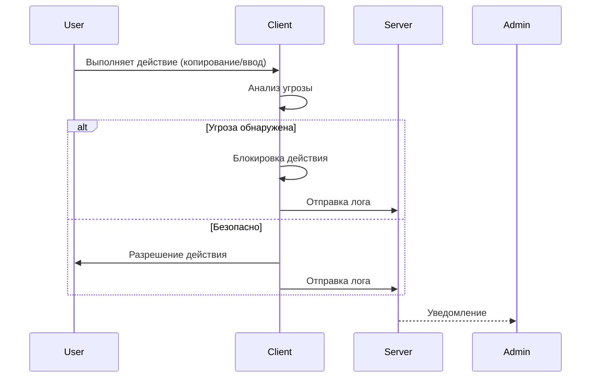

# DLP модель

В этой директории представлена незаконченная но **рабочая DLP модель** выполняющая специфичные для своих задач функции. Так же приложены лог-файлы которые были получены в результате функционирования системы.

**Взаимодействуя с операционной системой Windows** модули системы реализуют:
- Реалтайм-мониторинг
- Предотвращение угроз
- Логирование инцидентов

Системой так же предусмотрено:
- Взаимодействие между модулями для выявления более сложных инцидентов
- Передача данных между клиентом и админом
- Настройка параметров
- Обслуживание нескольких клиентов одновременно

## 🌆Архитектура решения

## 📦Модули 

- **Log модуль** создает структурированных журналов. Журналы имеют формат предназначенный для их обработки на админской стороне системы.

- **Модуль буфера обмена** реагирует на инциденты связанные с буфером обмена.

- **USB модуль** реагирует на инциденты связанные с съемными хранилищами.

- **Модуль активных окон** реагирует на подозрительные открытие и использование программ пользователем.

- **Keylogger модуль** реагирует на чувствительную информацию вводимую пользователем с клавиатуры, при этом сохраняя его **конфиденциальность**.

⚠️Это прототипы не являющиеся готовыми к реальному использованию, подходящие для лабораторной эксплуатации.⚠️